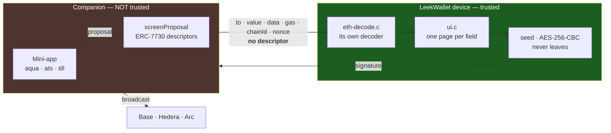
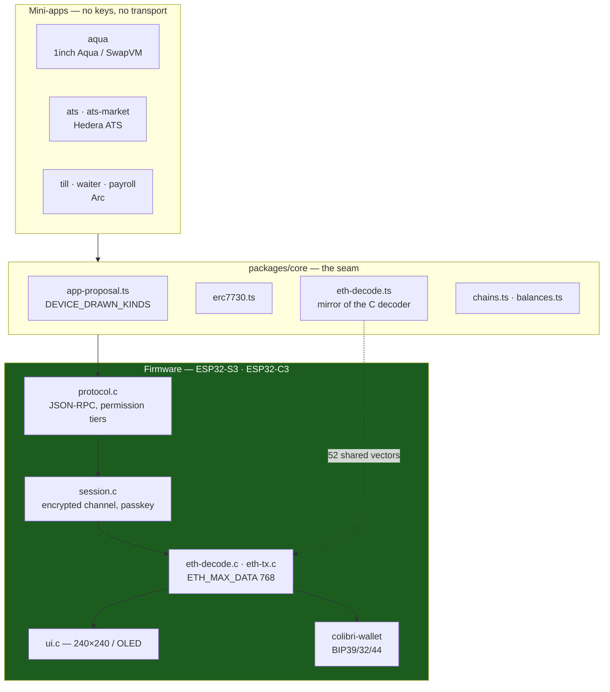
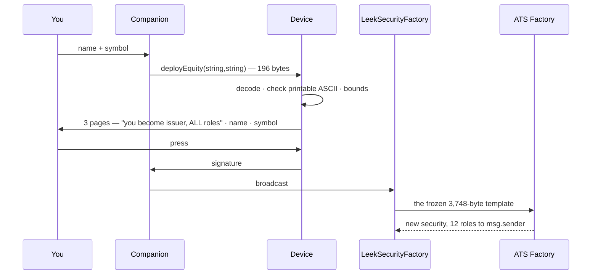
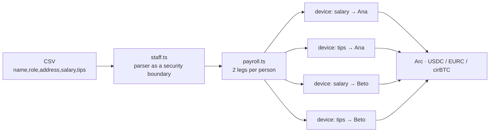
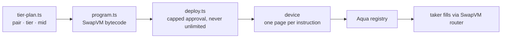

# Architecture

How a transaction gets signed, and which part of this system is trusted.

---

## The one idea

**Two gates, and only one of them is trusted.**

The companion renders a preview from ERC-7730 descriptors. That preview is
explicitly *untrusted* — it runs on a general-purpose computer that may already
be compromised, and the UI says so in those words. The device decodes the raw
calldata **independently**, with its own table, and draws what it found. No
descriptor is ever sent to the device: nothing the host says can change what
the screen shows.

If the device cannot read a call, it refuses it. That refusal is the product.

**Consequence:** supporting a new contract call means extending the *device*,
not the app. A host-side descriptor alone cannot make a call signable — proven
the hard way when the escrow market's `fill()` was refused by the firmware even
with a valid descriptor in place.

---

## The three tiers of decoding

| tier | cost | examples |
|---|---|---|
| **Static-typed** — one row in the firmware's table, no code | trivial | `fill(uint256)`, `list(address,uint256,uint256)`, `transfer`, `approve` |
| **Dynamic-typed** — a hand-written decoder, its host mirror, device pages, and shared vectors | days | Aqua `ship`/`dock`, `deployEquity(string,string)` |
| **Unknown** — blind signing, **off by default, switchable only on the device** | opt-in | anything else |

Blind signing exists because a wallet that decodes nothing new is unusable, and
a wallet that decodes everything is trusting somebody else's description. The
toggle lives on the device precisely because *a host that can disable the
protection is the host it was protecting you from.*

The firmware decoder and its TypeScript mirror are held together by **52 shared
vectors** emitted from the C code and replayed against the host
(`packages/core/test/eth-decode-vectors.json`), comparing decoded *content* —
not merely accept/reject.

---

## System layout

A mini-app **cannot** reach a key, a transport or the device. It builds
calldata and hands it to `screenProposal`; everything else is the shell's.
`app/test/apps.test.ts` enforces that, including that no app imports another
and that each carries its own CSS so it can be deleted whole.

---

## Per-track flows

### Hedera — issuance from a 240×240 screen

The ATS factory's `deployEquity` is a seventeen-field nested struct and **3,748
bytes**. The device holds 768 and refuses more. Raising the limit would not
help: a screen that says *"deploy equity, approve?"* over 3.7 KB nobody can
read is blind signing with better manners.

The template lives in verified on-chain code, so **name and symbol are not a
summary of the decision — they are all of it.** That is the only condition
under which drawing a call is not blind signing.

### Arc — payroll as two transactions per person

Salary and tips are sent **separately, on purpose**. Tips are not wages: they
are frequently owed to a pool, taxed differently and disputed separately. One
blended transfer is a number nobody can reconcile afterwards; two are two lines
in a ledger. Each is its own device screen and its own confirmation.

The CSV parser is treated as a security boundary because it is one: an
attacker-controlled file that ends in a transfer amount. It refuses rather than
coerces.

### 1inch Aqua — the device reads the program

A program the device cannot read **in full** refuses the whole ship. There is no
state where the legs are shown beside a program the device gave up on.

---

## What is deliberately not here

- **No key ever leaves the device.** The companion holds none.
- **No descriptor reaches the device.** It decodes independently.
- **No mini-app touches a transport.** The seam is `app-proposal.ts`.
- **No blind signing by default**, and no host command can enable it.
- **No balance is claimed as zero when it could not be read.** Unreadable and
  empty are different facts throughout.
